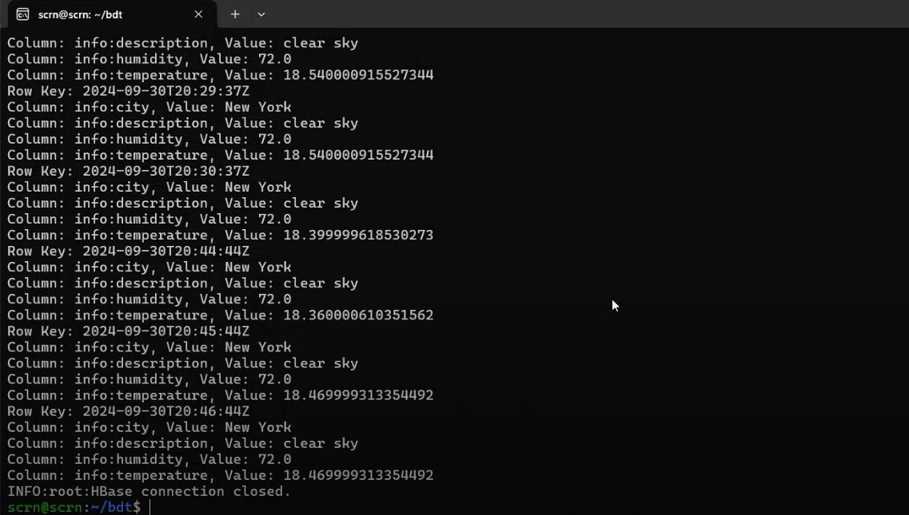

# cs523-bdt-miu
Big Data Technology Project
# Weather Data Streaming Application

This project involves real-time weather data streaming using Apache Kafka, Apache HBase, and Apache Spark for data processing and storage.

## Prerequisites

Ensure the following dependencies are installed:

- **Kafka**: Installed and properly configured.
- **HBase**: Installed and running.
- **Apache Spark**: Installed with appropriate packages for Kafka and Spark integration.
- **Python 3**: Installed with the necessary libraries (Kafka, HBase client).

### Required Kafka & Spark Packages:

- `org.apache.spark:spark-sql-kafka-0-10_2.12:3.5.3`
- `org.apache.kafka:kafka-clients:3.5.1`

## Overview

Here’s a brief overview of the architecture:

- We will be fetching weather data from the **OpenWeatherAPI**.
- The data will be sent to a **Kafka Producer**, which will push it to a Kafka topic.
- A **Kafka Consumer** will read the data from the topic and pass it to **Spark Streaming** for processing.
- Finally, the processed data will be stored in **HBase** for further analysis and querying.

### Architecture Diagram


## Steps to Run the Application

Follow these steps to start the necessary services, run the producer and consumer scripts, and verify the results.

### 1. Start Zookeeper
Zookeeper is required by Kafka for service coordination.

```bash
zookeeper-server-start.sh $KAFKA_HOME/config/zookeeper.properties
```

### 2. Start Kafka Server
Run the Kafka broker service.

```bash
kafka-server-start.sh $KAFKA_HOME/config/server.properties
```

### 3. Start HBase Thrift Server
The HBase Thrift server enables non-Java applications (like our Python consumer) to communicate with HBase.

```bash
hbase thrift start
```

### 4.  Start HBase
This command starts the HBase service for storing weather data.

```bash
start-hbase.sh
```


 ### 5. Run Kafka Producer (Weather Data Producer)
This script fetches real-time weather data from the OpenWeatherAPI and sends it to the Kafka topic called weather.

```bash
python3 weather_producer.py
```

 ### 6. Run Kafka Consumer with Spark Streaming
We use spark-submit to run the consumer code, which reads data from Kafka, processes it in Spark Streaming, and writes the results to HBase.

```bash
spark-submit \
  --master local[*] \
  --packages org.apache.spark:spark-sql-kafka-0-10_2.12:3.5.3,org.apache.kafka:kafka-clients:3.5.1 \
  weather_spark_consumer.py
```

 ### 7. Verify Consumer Output in Kafka
This command allows us to verify that the Kafka consumer is working by reading the data from the weather topic directly from the command line.

```bash
spark-submit \
kafka-console-consumer.sh --bootstrap-server localhost:9092 --topic weather --from-beginning
```


 ### 8. Check Data in HBase
1. Open HBase Shell:

```bash
hbase shell
```
 2. List tables

```bash
list
```

3. Scan the weather data table:

```bash
scan 'weather_data'
```

 ### 8. View Result Using Python
Run script.

```bash
python3 hbase_result.py
```

### Finally, we run a Python script to query the data from HBase and display it in a user-friendly format.


